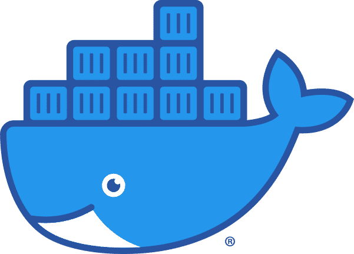



# Docker_Basics
Docker Basics tutorials for HAMK students. This is a composite repositorio of different docker labs [https://github.com/docker/labs ](https://github.com/docker/labs) and [https://dockerlabs.collabnix.com/](https://dockerlabs.collabnix.com/) updated and modified to your needs 

## 0.0 Installing Docker Desktop

## Next Steps
For the next step in the tutorial, head over to 

[1.0 Running your first container](./1.0_Running_your_first_container.md)

